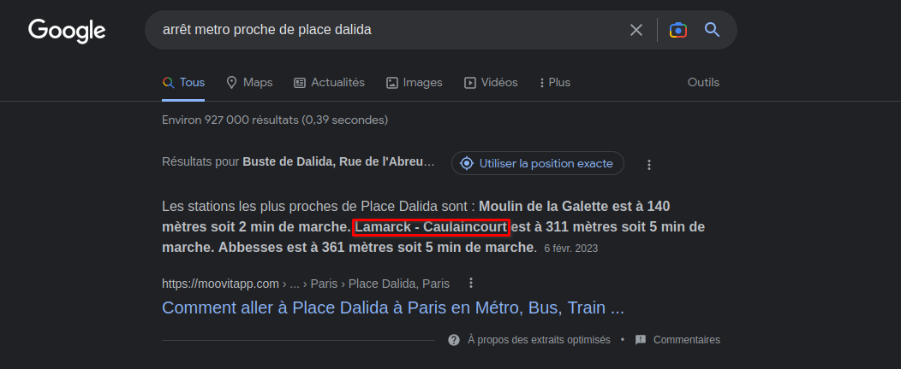

# Titre : Comment m'y rendre ?
## Description
Un ami m'a envoyé cette photo d'un endroit en France connu pour apparaitre dans un jeu vidéo, j'aimerais m'y rendre, pouvez-vous trouver le métro que je pourrais utiliser pour m'y rendre ?
## Solution
Une image nous ai donné, on peut la mettre dans google image voir si elle ressort :

On remarque rapidement qu'il s'agit de la Place Dalida à Paris, située dans le 18ème arrondissement.
On cherche maintenant qu'elle ligne de métro s'arrète proche de cette adresse. Une simple recherche google suffit :

Où depuis la page wikipédia :

Le flag est donc :`NHM2I{Lamarck-Caulaincourt}` ou `NHM2I{Lamarck}` ou `NHM2I{Caulaincourt}`
