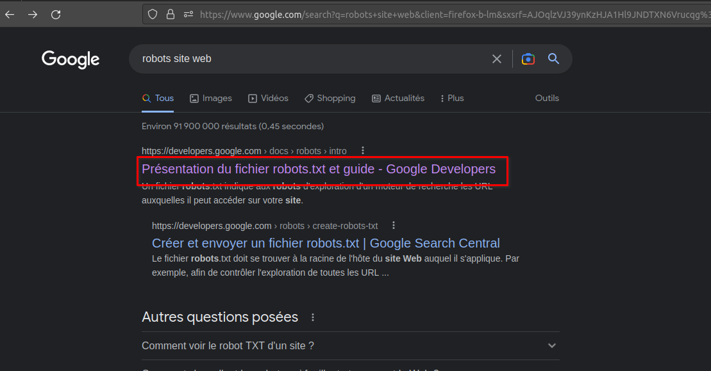
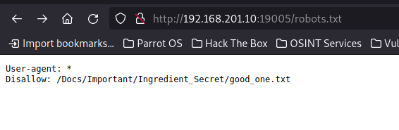

# Challenge
## Titre : Ingredient secret
## Description
Nous avons caché notre ingrédient secret dans notre site web retrouvez-le.

## Résolution
On peut faire une recherche sur internet :

On clique sur le site, le rôle du fichier robots.txt nous est expliqué.

On va voir le fichier `robots.txt` :

On remarque qu'il contient un chemin vers un fichier `secret.txt`.

On va voir le contenu de ce fichier :

Le flag est : `NHM2I{af711488-ec4e-45f8-91a8-0b0a1f998e7b}`
