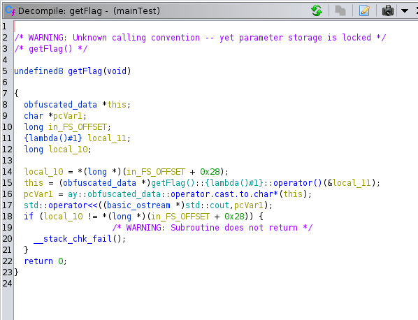
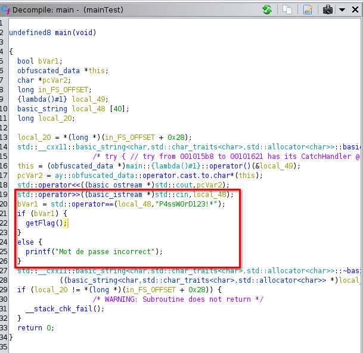

# Titre : Mot de passe perdu
## Description :
J'ai perdu le mot de passe de mon application, pouvez-vous le retrouver ?
## Solution :
On a un fichier qui est un executable linux :

```sh
$ file main
main: ELF 64-bit LSB pie executable, x86-64, version 1 (SYSV), dynamically linked, interpreter /lib64/ld-linux-x86-64.so.2, BuildID[sha1]=649807abe97a1e4136a42e35e75e5dffe1515e2d, for GNU/Linux 3.2.0, not stripped
```

Lorsqu'on le lance :
```sh
$ ./main 
Entrer le mot de passe :
test  
Mot de passe incorrect
```

Un mot de passe nous est demandé, s'il est incorrect la phrase `Mot de passe incorrect` est renvoyé.

Pour comprendre comment fonctionne ce programme, on va utiliser `Ghidra`. On ouvre notre fichier sur `Ghidra` puis dans l'onglet `functions` on se rend sur la fonction main :


On remarque également la présence d'une fonction `getFlag()` qui va être utilisé pour afficher le flag :





Cependant la fonction est complétement obfusqué. On va donc se focaliser sur la fonction `main`.

Le contenu de la fonction `main`:


On essaie de comprendre le code.

On se rend compte que :





Ici l'entrée utilisateur est stocké dans la variable `local_48`.

On effectue une comparaison entre la valeur de la variable `local_48` et la chaine de caractères `P4ssW0rD123!*`. 
Le résultat de cette comparaison est stocké dans la variable `bVar1` qui aura comme valeur `0` si la comparaison est fausse, `1` si la comparaison est vraie.

Ensuite si `bVar1` est vraie alors on appelle la fonction `getFlag()`. 

Sinon on renvoie `Mot de passe incorrect`.

Le mot de passe a saisir pour avoir le flag est donc : `P4ssW0rD123!*` :

```sh
$ ./main 
Entrer le mot de passe :
P4ssW0rD123!*
flag : NHM2I{ac78c15c-27e7-43af-b8b1-29df4e5831d8}
```

Le flag est donc : `NHM2I{ac78c15c-27e7-43af-b8b1-29df4e5831d8}`
