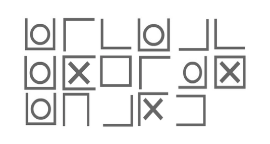

# Titre : OxO
## Description
Un message chiffré nous a été transmis saurez-vous le déchiffrer ?
## Solution
Le message chiffré est le suivant :

En cherchant sur internet on trouve l'alphabet correspondant au figures :

Et on peut déchiffrer le message :

`TICTACTOEISNTHARD`

Le flag est donc : `NHM2I{TICTACTOEISNTHARD}`

