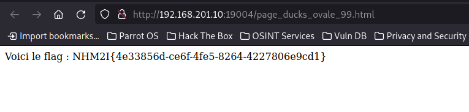

# Challenge
### Titre : Labyrinthe
### Description :
Vous êtes lâché dans un labyrinthe, arriverez-vous à trouver la sortie ?
## Installation du docker
## Résolution
Pour résoudre ce challenge on va devoir :
* Identifier sur la première et deuxième pages à quoi ressemble les liens vers les pages suivantes.
* Créer un script permettant de naviguer dans toutes les pages jusqu'a trouver la dernière qui contiendra le flag
### Identifier les liens vers les pages suivantes
Sur la première page on ouvre le code source de la page et on remarque qu'il y a un lien vers une autre page :


On peut cliquer sur le lien, on attéri donc sur la seconde page :


En cherchant de le code source :


On remarque que les éléments possèdent tous un href, mais que seul lien est fonctionnel c'est celui qui commence par `page_` et termine avec `.hmtl`.
On va donc pouvoir créer un script qui cherche dans nos pages web un `href` qui commence par `page_` et se termine avec `.hmtl`. Le script va aller sur la page suivante une fois le bon `href` trouvé jusqu'a arriver sur la page du flag qui est la dernière.
### Création d'un script permettant de trouver le flag
```py
import urllib.request
import re


page = 'http://192.168.201.10:19004/page_0.html'

def parse(page):
	url =  urllib.request.urlopen(page)
	#print(url)
	for line in url:
		#print(str(line))
		href = re.search(r'.*href=(page.*html)',line.decode())
		#print(href)
		if href == None:
			pass
		else:
			#print(href.group(1))
			page = "http://192.168.201.10:19004/"+href.group(1)
			print(page)
			parse(page)
			
	return page


parse(page)
``` 
Résultat :

```py
$python3 hypermaze.py 
http://192.168.201.10:19004/page_Moto_carre_1.html
http://192.168.201.10:19004/page_furry_rectangle_2.html
http://192.168.201.10:19004/page_equable_triangle_3.html
http://192.168.201.10:19004/page_ducks_carre_4.html
http://192.168.201.10:19004/page_plan_rond_5.html
http://192.168.201.10:19004/page_delirious_trapeze_6.html
http://192.168.201.10:19004/page_Moto_trapeze_7.html
http://192.168.201.10:19004/page_supply_triangle_8.html
http://192.168.201.10:19004/page_Camion_carre_9.html
http://192.168.201.10:19004/page_connect_ovale_10.html
http://192.168.201.10:19004/page_dull_etoile_11.html
http://192.168.201.10:19004/page_muddle_rond_12.html
http://192.168.201.10:19004/page_Chameau_etoile_13.html
http://192.168.201.10:19004/page_Camionnette_ovale_14.html
http://192.168.201.10:19004/page_quickest_triangle_15.html
http://192.168.201.10:19004/page_muddle_rond_16.html
http://192.168.201.10:19004/page_Prier_ovale_17.html
http://192.168.201.10:19004/page_plan_carre_18.html
http://192.168.201.10:19004/page_quickest_rectangle_19.html
http://192.168.201.10:19004/page_smelly_etoile_20.html
http://192.168.201.10:19004/page_Cerises_trapeze_21.html
http://192.168.201.10:19004/page_employ_rond_22.html
http://192.168.201.10:19004/page_supply_trapeze_23.html
http://192.168.201.10:19004/page_aberrant_trapeze_24.html
http://192.168.201.10:19004/page_connect_rond_25.html
http://192.168.201.10:19004/page_seal_rectangle_26.html
http://192.168.201.10:19004/page_chubby_triangle_27.html
http://192.168.201.10:19004/page_Boue_triangle_28.html
http://192.168.201.10:19004/page_chubby_triangle_29.html
http://192.168.201.10:19004/page_bomb_carre_30.html
http://192.168.201.10:19004/page_Camion_carre_31.html
http://192.168.201.10:19004/page_equable_carre_32.html
http://192.168.201.10:19004/page_transports_publics_ovale_33.html
http://192.168.201.10:19004/page_transports_prives_triangle_34.html
http://192.168.201.10:19004/page_Voiture_trapeze_35.html
http://192.168.201.10:19004/page_bomb_rectangle_36.html
http://192.168.201.10:19004/page_Pomme_trapeze_37.html
http://192.168.201.10:19004/page_Cerises_etoile_38.html
http://192.168.201.10:19004/page_Papier_rond_39.html
http://192.168.201.10:19004/page_Chameau_trapeze_40.html
http://192.168.201.10:19004/page_peel_ovale_41.html
http://192.168.201.10:19004/page_Voiture_carre_42.html
http://192.168.201.10:19004/page_Bateau_ovale_43.html
http://192.168.201.10:19004/page_transports_prives_etoile_44.html
http://192.168.201.10:19004/page_Pomme_etoile_45.html
http://192.168.201.10:19004/page_Ecriture_triangle_46.html
http://192.168.201.10:19004/page_Camion_etoile_47.html
http://192.168.201.10:19004/page_quickest_ovale_48.html
http://192.168.201.10:19004/page_Transports_triangle_49.html
http://192.168.201.10:19004/page_Chaussettes_trapeze_50.html
http://192.168.201.10:19004/page_muddle_rectangle_51.html
http://192.168.201.10:19004/page_peel_rond_52.html
http://192.168.201.10:19004/page_furry_ovale_53.html
http://192.168.201.10:19004/page_fit_etoile_54.html
http://192.168.201.10:19004/page_scent_rectangle_55.html
http://192.168.201.10:19004/page_Autonome_rond_56.html
http://192.168.201.10:19004/page_Chameau_rectangle_57.html
http://192.168.201.10:19004/page_Portrait_etoile_58.html
http://192.168.201.10:19004/page_Moto_carre_59.html
http://192.168.201.10:19004/page_island_rond_60.html
http://192.168.201.10:19004/page_Moto_carre_61.html
http://192.168.201.10:19004/page_Bateau_rectangle_62.html
http://192.168.201.10:19004/page_smelly_trapeze_63.html
http://192.168.201.10:19004/page_transports_publics_ovale_64.html
http://192.168.201.10:19004/page_Taxi_rectangle_65.html
http://192.168.201.10:19004/page_Radeau_rectangle_66.html
http://192.168.201.10:19004/page_furry_trapeze_67.html
http://192.168.201.10:19004/page_transports_prives_ovale_68.html
http://192.168.201.10:19004/page_superb_carre_69.html
http://192.168.201.10:19004/page_Radeau_triangle_70.html
http://192.168.201.10:19004/page_employ_triangle_71.html
http://192.168.201.10:19004/page_quickest_trapeze_72.html
http://192.168.201.10:19004/page_employ_carre_73.html
http://192.168.201.10:19004/page_unpack_rectangle_74.html
http://192.168.201.10:19004/page_glue_trapeze_75.html
http://192.168.201.10:19004/page_queen_trapeze_76.html
http://192.168.201.10:19004/page_island_triangle_77.html
http://192.168.201.10:19004/page_seal_trapeze_78.html
http://192.168.201.10:19004/page_plan_triangle_79.html
http://192.168.201.10:19004/page_superb_carre_80.html
http://192.168.201.10:19004/page_peel_trapeze_81.html
http://192.168.201.10:19004/page_seal_etoile_82.html
http://192.168.201.10:19004/page_Radeau_triangle_83.html
http://192.168.201.10:19004/page_dull_ovale_84.html
http://192.168.201.10:19004/page_scent_carre_85.html
http://192.168.201.10:19004/page_Moto_triangle_86.html
http://192.168.201.10:19004/page_connect_carre_87.html
http://192.168.201.10:19004/page_Transports_trapeze_88.html
http://192.168.201.10:19004/page_Pomme_ovale_89.html
http://192.168.201.10:19004/page_quickest_triangle_90.html
http://192.168.201.10:19004/page_fit_triangle_91.html
http://192.168.201.10:19004/page_Pomme_rond_92.html
http://192.168.201.10:19004/page_learn_etoile_93.html
http://192.168.201.10:19004/page_glue_carre_94.html
http://192.168.201.10:19004/page_Dentifrice_trapeze_95.html
http://192.168.201.10:19004/page_muddle_carre_96.html
http://192.168.201.10:19004/page_ducks_rond_97.html
http://192.168.201.10:19004/page_Portrait_rectangle_98.html
http://192.168.201.10:19004/page_ducks_ovale_99.html
```

La dernière page trouvé contient bien le flag :



Le flag est donc : `NHM2I{4e33856d-ce6f-4fe5-8264-4227806e9cd1}`

