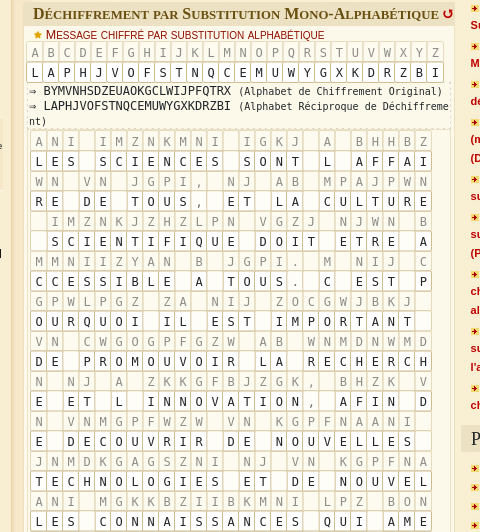
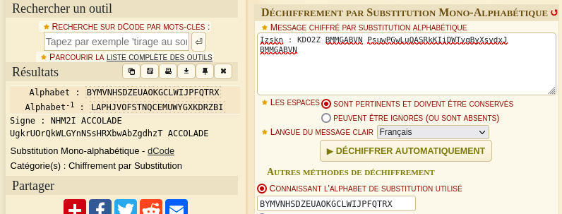

# WRITE UP CHALLENGE 'Mystère Et Boule De Gomme' - Rédigé par Hugo

## 1ère étape : Je récupère le texte
> Ab mrynwinmpwzjn nij vnfnkpn pk nkenp obenpw cgpw ani nkjwncwzini nj ani sgpfnwknonkji vp ogkvn nkjznw. Ani mrynwbjjblpni igkj vn capi nk capi igcdzijzlpnni nj ani mrynwmwzozknai pjzazinkj vni jnmdkzlpni vn capi nk capi bfbkmnni cgpw mgocwgonjjwn ani irijnoni zkhgwobjzlpni. Za nij vgkm mwpmzba vn cwnkvwn vni onipwni vn inmpwzjn bvnlpbjni cgpw cwgjnsnw ani vgkknni inkizyani nj ani zkhgwobjzgki mgkhzvnkjznaani.
> KDO2Z BMMGABVN PswPGwLQASRkKIiDWyqBysvdJ BMMGABVN

### Je peux voir qu'à la fin, il y a KDO2Z qui doit signifier NHM2I ?

## 2ème étape : Le passer dans Dcode (https://www.dcode.fr/substitution-monoalphabetique), ou avec l'outil analyse des fréquences ou je peux faire un script python à la main.
### Le texte étant soumis à une fréquence d'utilisation des lettres proches vraiment très proche de celle de la langue française, ça rend la tâche facile.

## 3ème étape : Déchiffrer le flag à part, une fois qu'on a l'alphabet.

## IMPORTANT : IL Y A UN PIEGE VOLONTAIRE, DANS LE TEXTE, LE FLAG EST INCLU A LA FIN. IL EST CASE SENSITIVE, DANS LA PLUPART DES SCRIPTS FAITS MAISON, ON ESSAIERA DE TOUT METTRE EN MAJUSCULE, OU TOUT METTRE EN MINUSCULE POUR DÉCHIFFRER.

### Flag : NHM2I{UgrUOrQWLGYnNSsHRbwAbgdhT}

alphabet : 

ABCDEFGHIJKLMNOPQRSTUVWXYZ
BYMVNHSDZEUAOKGCLWIJPFQTRX