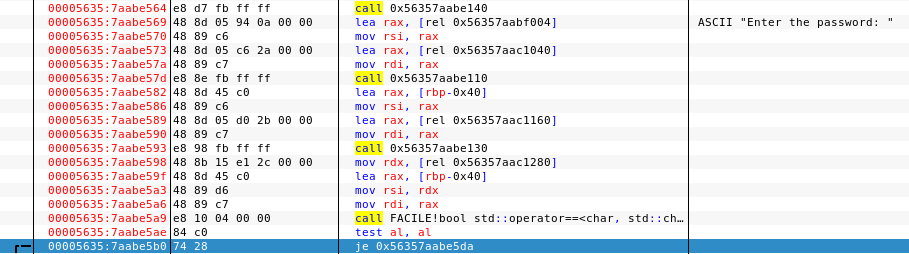
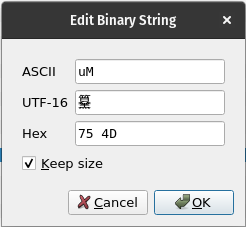
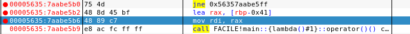
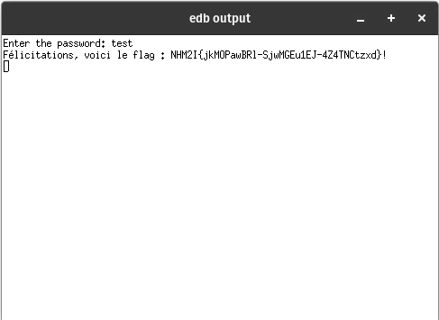

# WRITE UP CHALLENGE 'N0pe' - Rédigé par Hugo

## 1ère étape : 
### Télécharger le fichier exécutable.

## 2ème étape : 
### L'exécuter et constater qu'on nous demande un mot de passe (SPOILER : Le mdp ne peut pas être bruteforcé, ou en tout cas, le CTF sera fini lorsqu'il sera bruteforce).

## 3ème étape : 
### Ouvrir EDB, insérer le fichier et aller au point de démarrage.

> On peut voir sur la capture d'écran ci-dessus, qu'il y a un test "je" qui signifie une comparaison de valeur. On va donc éditer le test pour mettre un non equal to.

## 4ème étape : 
### Insérer des points d'arrêts et puis exécuter.
> Ci-dessous, c'est les petits points rouges.

## 5ème étape : 
### Exécuter le code et regarder l'output :
.

### Flag : NHM2I{jkMOPawBRl-SjwMGEu1EJ-4Z4TNCtzxd}