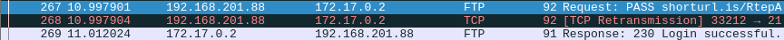

# WRITE UP CHALLENGE 'Never gonna give you up' - Rédigé par Hugo

## 1ère étape : 
### Ouvrir le PCAP avec Wireshark ou un autre logiciel d'analyse de trames réseaux

## 2ème étape : 
### Trouver le login successful et regarder le mot de passe : "shorturl.is/RtepA"

## Remarques : 
### Il y a plusieurs mots de passes essayés, mais il y en a qu'un qui a un login successful. Les mots de passes sont sous forme de lien, ça peut être perturbant, mais c'est bien des mots de passes.