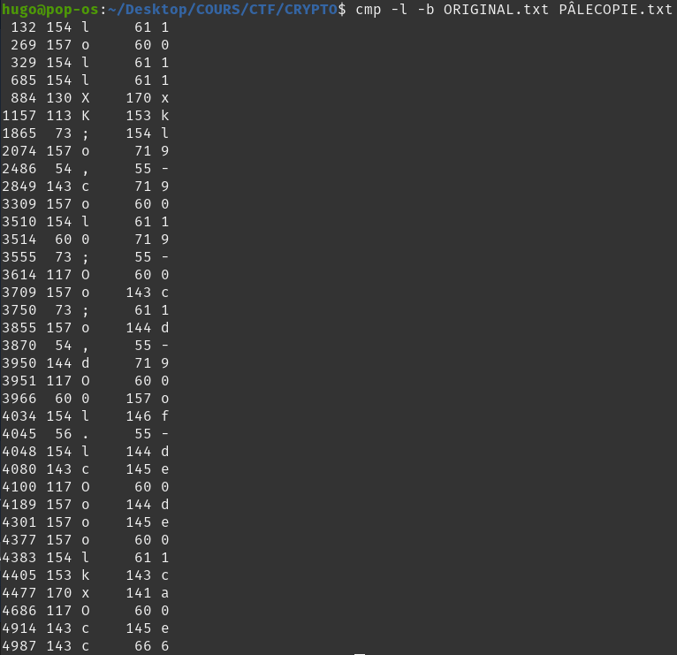

# WRITE UP CHALLENGE 'Orcs' - Rédigé par Hugo

## 1ère étape : Ouvrir les deux fichiers, constater qu'ils sont identiques à l'oeil nu...

## 2ème étape : Rechercher un script qui le fait, ou simplement en faire un soit même

## 3ème étape : Commande : `cmp -l -b ORIGINAL.txt PÂLECOPIE.txt`

## 4ème étape : Rassembler le flag, représenté par les différences de la deuxième colonne.

## 5ème étape : On s'attend à avoir un chiffrement avec une clé car dans l'énoncé il y a 'FORCE ET HONNEUR'.
> C'est donc un chiffrement par transposition.

Une fois déchiffré avec 'FORCE ET HONNEUR', il faut entourer le flag par NHM2I{}.

## Flag : NHM2I{106XOKF9011A9E0D1E0D09019ECCLD01}