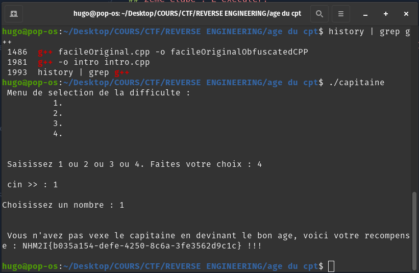

# WRITE UP CHALLENGE 'POV : M. Naviliat' - Rédigé par Hugo

## 1ère étape : Télécharger le fichier.

## 2ème étape : L'exécuter.

## 3ème étape : Il y a 4 difficultés avec un randint qui varie entre 1-100, 1-500, 1-1000, et l'une où on choisit la range.

## 4ème étape : Il faut donc choisir la range et mettre 1 pour avoir 1 chance sur 1 de trouver le bon. Et on gagne à coup sûr.

## Flag : NHM2I{b035a154-defe-4250-8c6a-3fe3562d9c1c}

## Commentaire : Il y a un indice disponible.