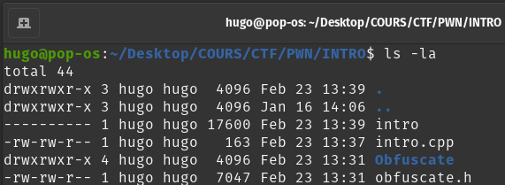
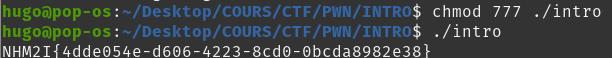

# WRITE UP CHALLENGE 'Ezpwn' - Rédigé par Hugo

## 1ère étape : 
### Télécharger le dossier zippé, le dézippé.

## 2ème étape : 
### Exécution du programme
> On ne peut pas le lire ni l'exécuter car on n'a pas les droits.

## 3ème étape : 
### Donner les droits grâce à chmod.

## 4ème étape : 
### Exécuter le script et récupérer le flag.
NHM2I{4dde054e-d606-4223-8cd0-0bcda8982e38}
