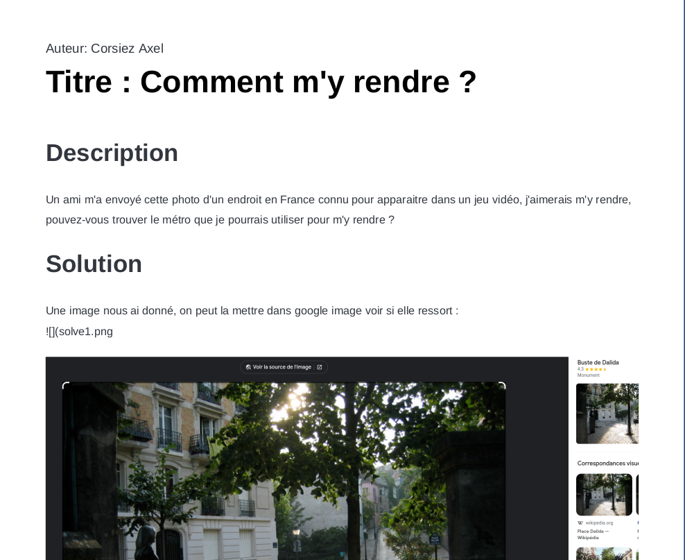
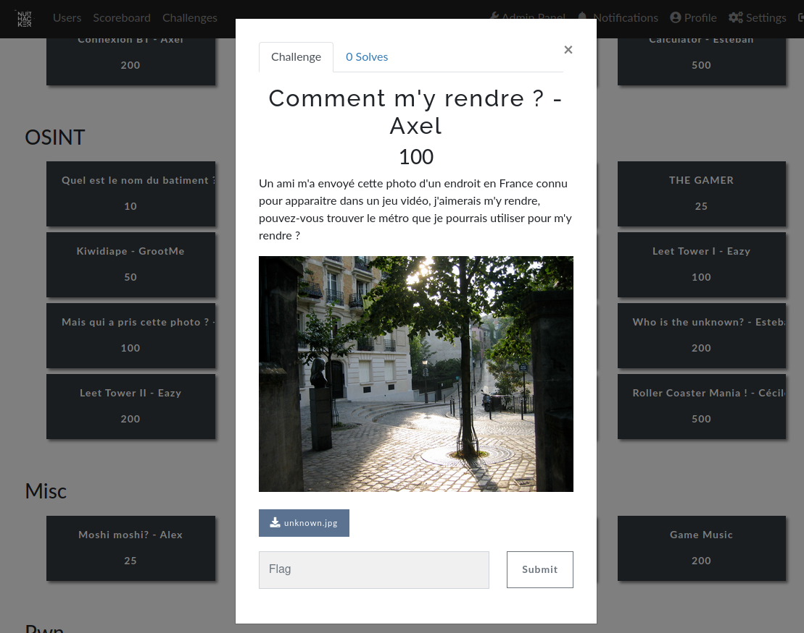

# Projet CTF
Ici mettez tous vos rendus dans un format acceptable (lisible et comprehensible facilement), chacun pourra le mettre sur son tél et y avoir accès pendant le CTF et pourra aider en cas de problème sur des challenges 
## Attendu :
Le titre du writeup doit être EXACTEMENT pareil que le nom du challenge sur CTFd


## Rendus
Les rendus seront au format :
```
Rendus/
├─ Romain/
│  ├─ challenge1.pdf
├─ Axel/
│  ├─ commentmyrendre.pdf
├─ Hugo/
│  ├─ challenge1.txt
│  ├─ challenge2.txt
```
## Exemple :
Writeup :


CTFd :


