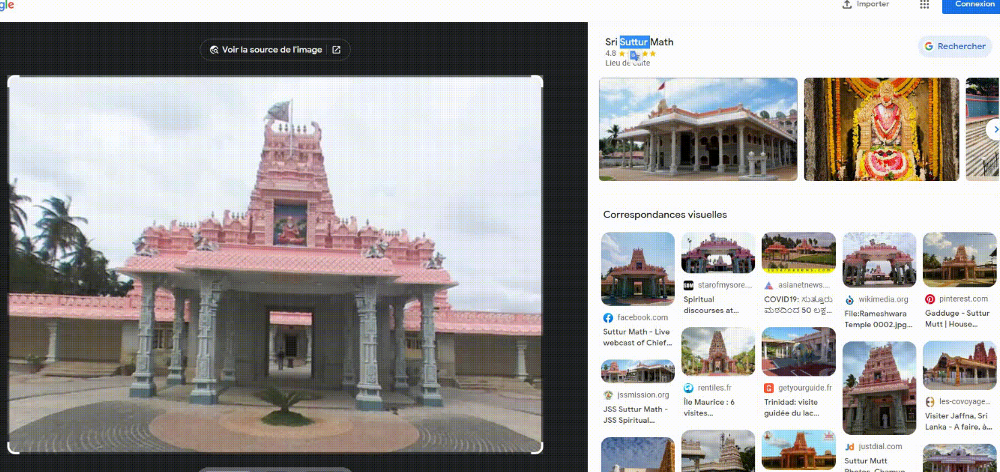

Il faut faire une reverse inversée google image sur la façade du bâtiment :

Le nom du bâtiment est Sri Suttur Math
# flag attendu (plusieurs possibilités):
`NHM2I{Suttur}`
`NHM2I{Sri_Suttur_Math}`
`NHM2I{Suttur_Math}`
