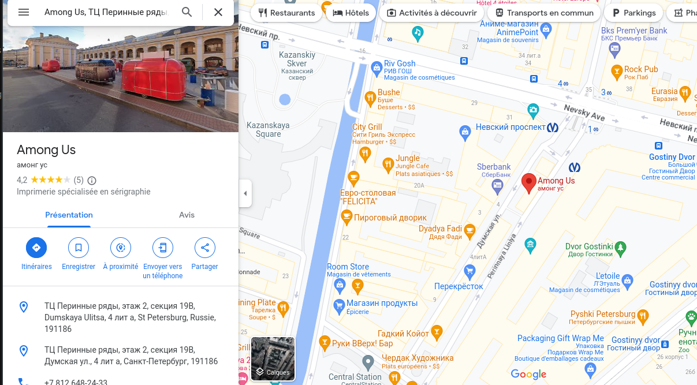

# Among_Maps

:warning: Ce write-up est destinée uniquement au participant à l'événement "La nuit du Hack" et ne dois faire l'objet d'aucune autre diffusion :exclamation:

| Apprentis     | Catégorie       | Niveau                                                                         |
| :-------------- | :----------- | :------------------------------------------------------------------------------ |
| Sofiane Zekri | Osint | Facile |

## Énoncé

* Nous cherchons où a été prise cette photo, peux-tu me le dire ?
* Le flag est sous la forme NHM2I{Pays_Ville} (sans majuscule ni accent)

## Flag
NHM2I{russie_saint-petersbourg}

## Résolution

### Analyser l'image
Examinez attentivement l'image que vous avez reçue. Recherchez des indices tels que des bâtiments, des panneaux de signalisation, des enseignes, des drapeaux, des monuments ou des caractéristiques géographiques uniques qui pourraient vous aider à identifier le lieu. Utilisez Google Image Search pour trouver d'autres images similaires et comparer les résultats pour trouver des indices supplémentaires.

### Correction
J'utilise Maps et Google image pour trouver ceci:

### Utiliser des outils de reconnaissance d'image
Utilisez des outils de reconnaissance d'image tels que Google Lens, TinEye, ou Reverse Image Search pour identifier l'emplacement de l'image. Ces outils peuvent fournir des informations supplémentaires sur le lieu et des images similaires qui pourraient vous aider à l'identifier.

### Conception 
Pour mettre en place ce challenge, j'ai cherché une structure en rapport avec le jeu vidéo "Among US"
C'est par hasard que je suis tombé sur ces caravanes.

### Conclusion
Ces étapes devraient vous aider à trouver le lieu caché dans l'image pour ce challenge d'OSINT.
