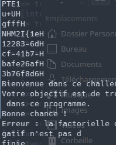

# ThatTingGoSkrraaa
:warning: Ce write-up est destinée uniquement au participant à l'événement "La nuit du Hack" et ne dois faire l'objet d'aucune autre diffusion :exclamation:


| Apprentis     | Catégorie       | Niveau                                                                         |
| :-------------- | :----------- | :------------------------------------------------------------------------------ |
| Sofiane - Hugo - Romain | Misc | Moyen |

## Énoncé
Nous avons exfiltré des donnée via ce qr code à toi de les récupérer.


## Flag
NHM2I{1e12283-6dcf-41b7-bafe26af3b76f8d6}

## Résolution
Le but est de decomposé frame par frame le qr code et de recupérer la data qu'il contienne
J'ai utilisé ce programme pour décomposer le gif et recuperer le binaire:
```bash
#!/bin/bash

function check_package() {
    REQUIRED_PKG="$1"
    PKG_OK=$(dpkg-query -W --showformat='${Status}\n' $REQUIRED_PKG 2> /dev/null | grep "install ok installed")
    [ -n "$PKG_OK" ] && return $?
}

# requires qrencode and ffmpeg
#check_package "zbarimg" || { echo "[!] zbar-tools package is missing. Please install it: sudo apt-get install zbar-tools"; exit 1; }
#check_package "ffmpeg" || { echo "[!] ffmpeg package is missing. Please install it: sudo apt-get install ffmpeg"; exit 1; }

# get file from input
file="$1"
output="$2"

# check if 2nd argument is provided
if [ -z "$output" ]; then
    output="original.dat"
fi

# check if the file exists
if [ ! -f "$file" ]; then
    echo "Input file not found"
    exit 1
fi

# split gif
echo "Splitting GIF into QR PNGs..."
ffmpeg -i "$file" -fps_mode passthrough frame%d.png

# calculate number of qrcodes
nqrcodes=$(ls -1 frame* | wc -l)

# decode qrcodes
echo "Decoding qrcodes..."
for i in $(seq 1 $nqrcodes); do
    zbarimg -q frame$i.png | sed 's/QR-Code://' | perl -pe 'chomp if eof' >> $output
done

# clean up
echo "Cleaning up..."
rm -f frame*

echo "Done!"
```
Le fichier est corrompu due au procéder, mais le code source reste lisible.
Voici le flag:




## Mise en place
```
cd /home/students/CTF/Sofiane/XXX
sudo docker-compose up -d
```
 
