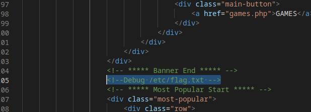
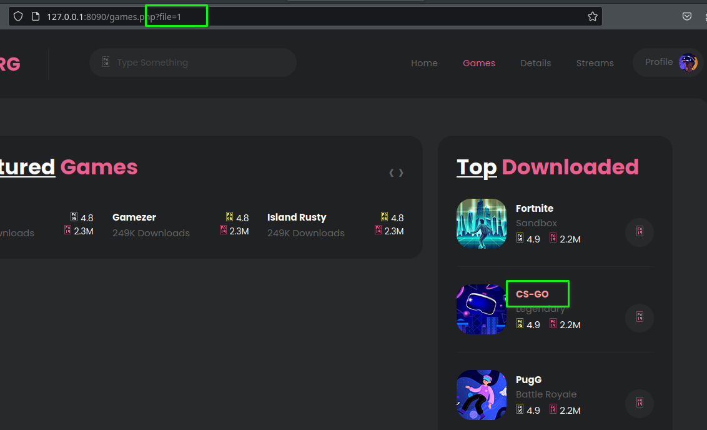
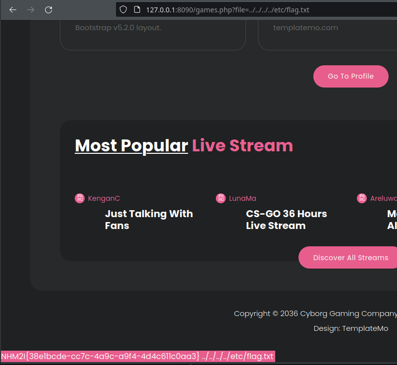

# The ladder game

:warning: Ce write-up est destinée uniquement au participant à l'événement "La nuit du Hack" et ne dois faire l'objet d'aucune autre diffusion :exclamation:


| Apprentis     | Catégorie       | Niveau                                                                         |
| :-------------- | :----------- | :------------------------------------------------------------------------------ |
| Sofiane Zekri | Web | Moyen |

## Énoncé


## Flag
NHM2I{jvmkvcufcrtjexvdk}

## Résolution
Trouver l'indice dans le code source :



Une fois l'indice en poche trouver un point d'injection pour le Directory traversal:



Il manque plus que l'injection dans l'url pour trouver le flag dans le dossier *flag.txt* :




## Mise en place
```
cd /home/students/CTF/Sofiane/XXX
sudo docker-compose up -d
```
[Code source](games.php)
 
