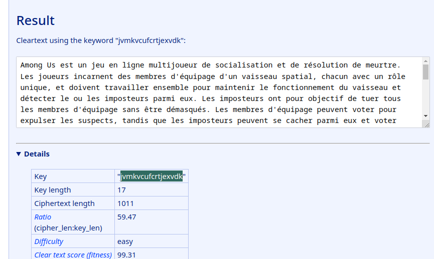

# Where is the Key ?

:warning: Ce write-up est destinée uniquement au participant à l'événement "La nuit du Hack" et ne dois faire l'objet d'aucune autre diffusion :exclamation:

| Apprentis     | Catégorie       | Niveau                                                                         |
| :-------------- | :----------- | :------------------------------------------------------------------------------ |
| Sofiane Zekri | Crypto | Facile |

## Énoncé

* Un message a été intercepté trouve la clé
* Le flag est sous la forme NHM2I{Key}

## Flag
NHM2I{jvmkvcufcrtjexvdk}

## Résolution

### Comprendre le chiffrement de Vigenère
Le chiffrement de Vigenère est une méthode de chiffrement par substitution polyalphabétique. Cela signifie que chaque lettre du message est chiffrée en utilisant une clé qui est décalée d'un certain nombre de positions dans l'alphabet. La clé est utilisée de manière répétitive pour chiffrer tout le message. Pour résoudre ce type de chiffrement, il est nécessaire de connaître la clé utilisée pour le chiffrer.

### Analyser le message chiffré
Examinez le message chiffré que vous avez reçu. Observez la longueur du message, la fréquence des lettres et les motifs dans le message. Cela peut vous aider à trouver des indices sur la clé utilisée.

### Utiliser une analyse de fréquence
L'analyse de fréquence est une méthode courante pour attaquer les chiffrements de substitution. Dans le cas du chiffrement de Vigenère, cette technique consiste à diviser le message en plusieurs sous-messages, chaque sous-message étant chiffré avec la même lettre de la clé. Ensuite, vous pouvez effectuer une analyse de fréquence sur chaque sous-message pour déterminer la lettre de la clé utilisée pour le chiffrer. Répétez ce processus pour chaque lettre de la clé jusqu'à ce que vous ayez déterminé la clé complète.
Des outils en ligne existe comme : https://www.guballa.de/vigenere-solver

### Trouver le flag
Une fois que vous avez trouvé la clé utilisée pour chiffrer le message, elle devrait être identique au flag recherché. Assurez-vous de bien comprendre le format du flag (par exemple, s'il doit être en majuscules ou en minuscules) pour vous assurer de saisir le bon texte en clair comme flag.
