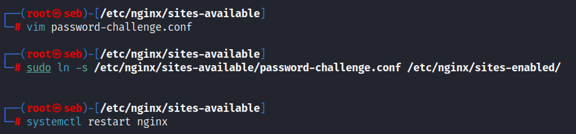
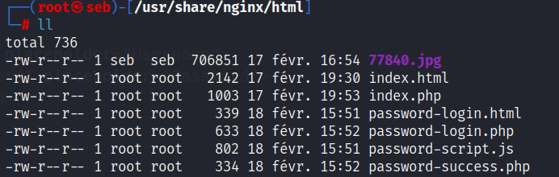

# SOLVE() :

```python
encrypted = "String.fromCharCode(0x61,%206c,%2065,%2072,%2074,%2028,%2027,%2035,%2065,%2061,%2062,%2064,%2069,%2063,%2067,%202d,%2061,%2062,%2066,%202d,%2034,%2033,%2039,%2031,%202d,%2061,%2030,%2030,%2033,%202d,%2030,%2064,%2065,%2066,%2065,%2063,%2059,%2062,%2064,%2061,%2039,%2027,%2029)"
ascii_codes = encrypted.replace('String.fromCharCode(', '').replace(')', '').split(',')
decoded_message = ''
for code in ascii_codes:
    if code.startswith('%20'):
        code = code[3:]
    decoded_message += chr(int(code, 16))
print(decoded_message)
#password == alert('5eabdicg-abf-4391-a003-0defecYbda9')
```

# CONFIG :

Require PHP8.2-FPM and NGINX.





config nginx : (password-challenge.conf)

```bash
server {
    listen 89;
    server_name 127.0.0.1;

    root /usr/share/nginx/html;
    index password-login.html;

    location / {
        try_files $uri $uri/ /index.php$is_args$args;
    }

    location ~ \.php$ {
        include snippets/fastcgi-php.conf;
        fastcgi_pass unix:/run/php/php8.2-fpm.sock;
    }

    location /password-login.html {
        try_files $uri $uri/ /password-login.php$is_args$args;
    }

    location /password-script.js {
        try_files $uri $uri/ /password-script.js;
    }

    location /password-login.php {
        include snippets/fastcgi-php.conf;
        fastcgi_pass unix:/run/php/php8.2-fpm.sock;
        fastcgi_param SCRIPT_FILENAME /usr/share/nginx/html/password-login.php;
    }

    location /password-success.php {
        include snippets/fastcgi-php.conf;
        fastcgi_pass unix:/run/php/php8.2-fpm.sock;
        fastcgi_param SCRIPT_FILENAME /usr/share/nginx/html/password-success.php;
    }
}
```

HTML (password-login.html) :

```html
<!DOCTYPE html>
<html>
<head>
  <title>Login Form</title>
  <style>
    html { color-scheme: light dark; }
    body { width: 35em; margin: 0 auto;
    font-family: Tahoma, Verdana, Arial, sans-serif; }
    </style>
</head>
<body>
  <h1>Login Form</h1>
  <form>
    <input type="text" name="username" placeholder="Username">
    <input type="password" name="password" placeholder="Password">
    <button type="submit">Login</button>
  </form>

  <script src="password-script.js"></script>
  <script>
        var username = 'admin';
        var password = String.fromCharCode(0x61,%200x6c,%200x65,%200x72,%200x74,%200x28,%200x27,%200x35,%200x65,%200x61,%200x62,%200x34,%200x39,%200x63,%200x37,%200x2d,%200x61,%200x32,%200x39,%200x66,%200x2d,%200x34,%200x33,%200x39,%200x31,%200x2d,%200x61,%200x30,%200x30,%200x33,%200x2d,%200x30,%200x34,%200x65,%200x66,%200x65,%200x63,%200x35,%200x39,%200x62,%200x64,%200x61,%200x39,%200x27,%200x29);
    </script>
</body>
</html>
```

JavaScript (password-script.js) :

```javascript
const form = document.querySelector("form");

form.addEventListener("submit", function(e) {
  e.preventDefault();

  const username = form.elements.username.value;
  const password = form.elements.password.value;

  const xhr = new XMLHttpRequest();
  xhr.open("POST", "password-login.php");
  xhr.setRequestHeader("Content-Type", "application/x-www-form-urlencoded");
  xhr.onreadystatechange = function() {
    if (this.readyState === XMLHttpRequest.DONE && this.status === 200) {
      const response = JSON.parse(this.responseText);
      if (response.success) {
        window.location.href = "password-success.php";
      } else {
        alert(response.message);
      }
    }
  };
  
  const data = "username=" + encodeURIComponent(username) + "&password=" + encodeURIComponent(password);
  xhr.send(data);
});
```

PHP (password-success.php) :

```php
<?php
session_start();

if (!isset($_SESSION["authenticated"]) || !$_SESSION["authenticated"]) {
  header("Location: password-login.php");
  exit; // arrête l'exécution du script ici
}
else {
  // Si l'utilisateur est authentifié, le code HTML est exécuté ci-dessous
  ?>
  <!DOCTYPE html>
  <html>
  <head>
    <title>Success</title>
    <style>
      html { color-scheme: light dark; }
      body { width: 35em; margin: 0 auto;
      font-family: Tahoma, Verdana, Arial, sans-serif; }
    </style>
  </head>
  <body>
    <h1>Login Successful</h1>
    <p>Bravo ! Vous êtes bien authentifié en tant que admin. FLAG{XXX}</p>
  </body>
  </html>
  <?php
}
?>
```

PHP (password-login.php) :

```php
<?php
session_start();

if ($_SERVER["REQUEST_METHOD"] == "POST") {
  $username = $_POST["username"];
  $password = $_POST["password"];

  // Vérification des informations d'identification
  if ($username === "admin" && $password === "alert('5eab49c7-a29f-4391-a003-04efec59bda9')") {
    $_SESSION["authenticated"] = true;
    $response = array("success" => true, "message" => "Bravo : FLAG{XXX}");
  } else {
    $response = array("success" => false, "message" => "Invalid username or password.");
  }

  // Envoi de la réponse JSON à la page web
  header('Content-Type: application/json');
  echo json_encode($response);
}
?>
```
